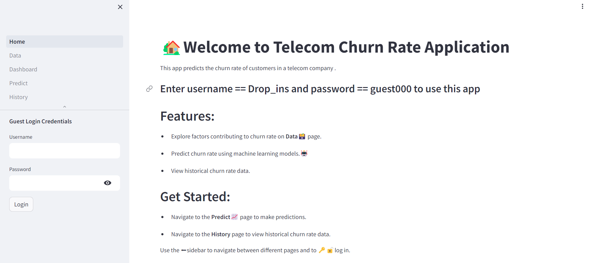

# Churn-Rate-App
</div>


<!-- TABLE OF CONTENTS -->

# 📗 Table of Contents

- [📗 Table of Contents](#-table-of-contents)
- [Churn-Rate-App ](#Churn-Rate-App-)
  - [🛠 Built With ](#-built-with-)
    - [Tech Stack ](#tech-stack-)
  - [Key Features ](#key-features-)
  - [💻 Getting Started ](#-getting-started-)
    - [Prerequisites](#prerequisites)
    - [Setup](#setup)
    - [Install](#install)
    - [Usage](#usage)
  - [📝 License ](#-license-)

# Churn-Rate-App <a name="about-project"></a>

This is a data application for predicting customer churn rate at a telecom company. This app uses machine learning models allowing users to gain insight by a data visualization page and also see values of their inputs which have been saved in a history page for future use.  

Data Dictionary
The following describes the columns present in the data.

1. **Gender** -- Whether the customer is a male or a female
2. **SeniorCitizen** -- Whether a customer is a senior citizen or not?
3. **Partner** --  Whether the customer has a partner or not (Yes, No)
4. **Dependents** -- Whether the customer has dependents or not (Yes, No)
5. **Tenure** -- Number of months the customer has stayed with the company
6. **Phone Service** -- Whether the customer has a phone service or not (Yes, No)
7. **MultipleLines** -- Whether the customer has multiple lines or not
8. **InternetService** -- Customer internet service provider (DSL, Fiber Optic, No)
9. **OnlineSecurity** -- Whether the customer has online security or not (Yes, No, No Internet)
10. **OnlineBackup** -- Whether the customer has online backup or not (Yes, No, No Internet)
11. **DeviceProtection** -- Whether the customer has device protection or not (Yes, No, No internet service)
12. **TechSupport** -- Whether the customer has tech support or not (Yes, No, No internet)
13. **StreamingTV** -- Whether the customer has streaming TV or not (Yes, No, No internet service)
14. **StreamingMovies** -- Whether the customer has streaming movies or not (Yes, No, No Internet service)
15. **Contract** -- The contract term of the customer (Month-to-Month, One year, Two year)
16. **PaperlessBilling** -- Whether the customer has paperless billing or not (Yes, No)
17. **Payment Method** -- The customer's payment method (Electronic check, mailed check, Bank transfer(automatic), Credit card(automatic))
18. **MonthlyCharges** -- The amount charged to the customer monthly
19. **TotalCharges** -- The total amount charged to the customer

## 🛠 Built With <a name="built-with"></a>

### Tech Stack <a name="tech-stack"></a>

To build this application i made use of the following

**Streamlit as framework of application**

**Data from Mysql server**

**Python language**

**Models from Sklearn**


## Key Features <a name="key-features"></a>

- **A home page that gives a brief description of the application and also login in credentials for the app**
- **A data page which displays data loaded from the remote server**
- **A prdeict page which allows users to select the model they want to use and input various parameters for prediction**
- **A history page that saves predictions made for future analysis**
- **A dashboard that displays visualization of the data**



## 💻 Getting Started <a name="getting-started"></a> 
To get started with the Churn rate app  project, follow the steps below:


### Prerequisites
Ensure you have the following installed:

- Python
- Streamlit

### Setup
Clone the repository to your local machine by using:
```sh
git clone https://github.com/Baakwa/Churn-Rate-App.git
```
Navigate to the project directory:

```sh
cd Churn-Rate-App
```

Create a virtual environment:

```sh
On windows;
virtual_env/Scripts/activate
```

### Install 

Install the required Python packages:
```sh
pip install -r requirements.txt
```
### Usage
To run the Churn Rate application, execute the following command:

streamlit run Home.py

- Navigate to the provided URL  or a web brower opens to access the application.
- Use the credentials username=Drop_ins and password=guest000 to log in.
- Explore the features and functionalities of the application.

  
## 📝 License <a name="license"></a>

This project is [MIT](./LICENSE) licensed.


  
